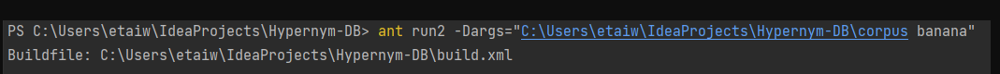

# HypernymDB


## General Information
This Java software uses Hearst patterns, a collection of lexical and syntactic patterns, to extract hypernym-hyponym links between noun phrases. Hearst patterns are used to identify hypernymy interactions. The computer extracts hypernym-hyponym pairs from a given text corpus by identifying Hearst patterns using regular expression matching and string manipulation techniques.
The collection of words contains  5GB corpus which was edited before and added  <np> and </np> tags on every Noun Phrase,
then by using String manipulations (to optimize search) and regex matching of 5 different Hearst Patterns it creates a Database of Hypernyms and Hyponyms.
For each Hyponym we count how many times it appeared in the corpus in different patterns.

The patterns I identified are ({} means optionally):

1. `NP {,} such as NP {, NP, ..., {and|or} NP}`.
   In this pattern, the first NP is the hypernym and the NPs after the words "such as" are hyponyms.
   Example: "semitic languages such as Hebrew or Arabic are composed of consonants and vowels"
   semitic language ⟶ Hebrew
   semitic language ⟶ Arabic

2. `such NP as NP {, NP, ..., {and|or} NP}`.
   Here again, the first NP is the hypernym and the NPs after the words "as" are hyponyms.
   Example: "courses taught by such lecturers as Hemi, Arie, and Hodyah are great"
   lecturers ⟶ Hemi
   lecturers ⟶ Arie
   lecturers ⟶ Hodyah

3. `NP {,} including NP {, NP, ..., {and|or} NP}`
   Here again, the first NP is the hypernym and the NPs after the words "including" are hyponyms.

4. `NP {,} especially NP {, NP, ..., {and|or} NP}`
   Here again, the first NP is the hypernym and the NPs after the words "especially" are hyponyms.

5. `NP {,} which is {{an example|a kind|a class} of} NP`
   Here, the first NP is the hyponym and the second in a hypernym. Example: "Object oriented programming, which is an example of a computer science course" You should accept the following: (the "," is optionally)

- NP {,} which is NP
- NP {,} which is an example of NP
- NP {,} which is a kind of NP
- NP {,} which is a class of NP


## Setup
1. Clone the repository:

```
git clone https://github.com/EtaiWil/HypernymDB.git
```
2. Download the corpus from [here](https://drive.google.com/file/d/1knTy0gYblqEZaSFWsHxk2NgOM59mwolP/view?usp=sharing)
3. Download Apache Ant from [here](https://ant.apache.org/bindownload.cgi) to use the build file to compile and run the program.
4. Open the terminal in the folder that contains the build files and the src folder and enter `ant clean `  
 to compile:

```
ant compile 
```

To run on a corpus and get the whole database into a file enter:

```
ant run1 -Dargs="<First argument - The directory of the corpus> <Second argument- name for the new output file>"  
```
For example:


To search a lemma in the corpus to find its hypernyms enter:

``` 
ant run2 -Dargs="<First argument - The directory of the corpus> <Second argument - the lemma to search for>" 
```
For example:



That how the file look after run1:

We can impress from how  big is the txt file almost 64,000 lines of matching!


Here we can see the result of run2:

We can see that the  program used the data and identified that "banana" is some food/crop.
## Built with

- Java


## Author 

**Etai Wilentzik**

- [Profile](https://github.com/EtaiWilentzik )
- [LinkedIn]( https://www.linkedin.com/in/etai-wilentzik/ "Welcome")

## Support 🤝 

Contributions, issues, and feature requests are welcome!

Give a ⭐️ if you like this project!
